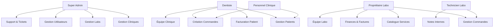
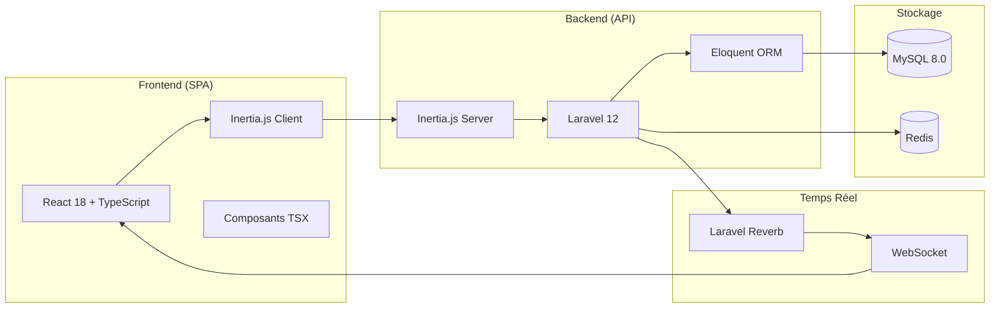
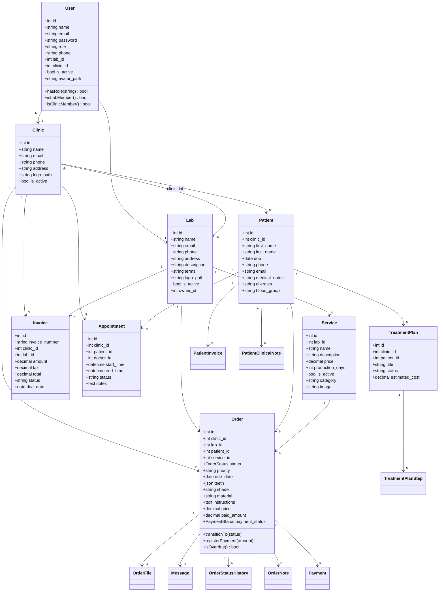
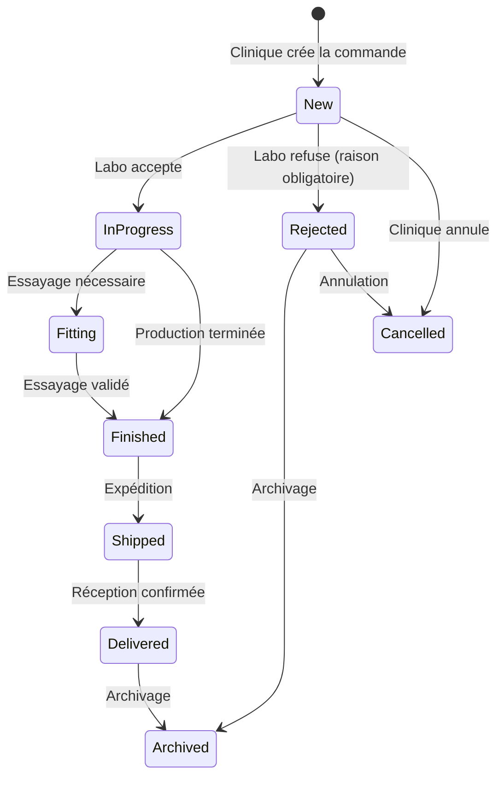
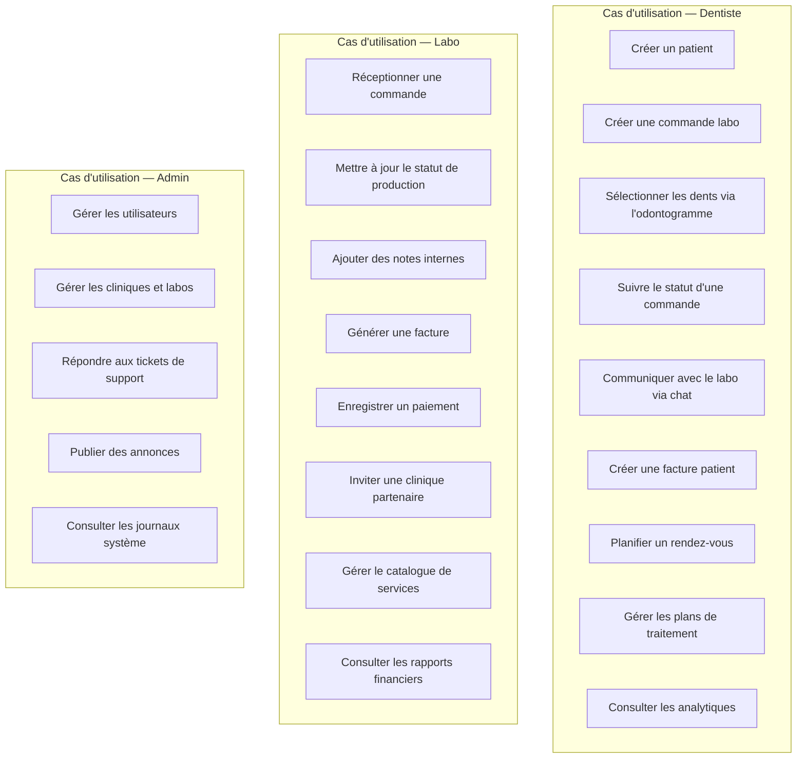
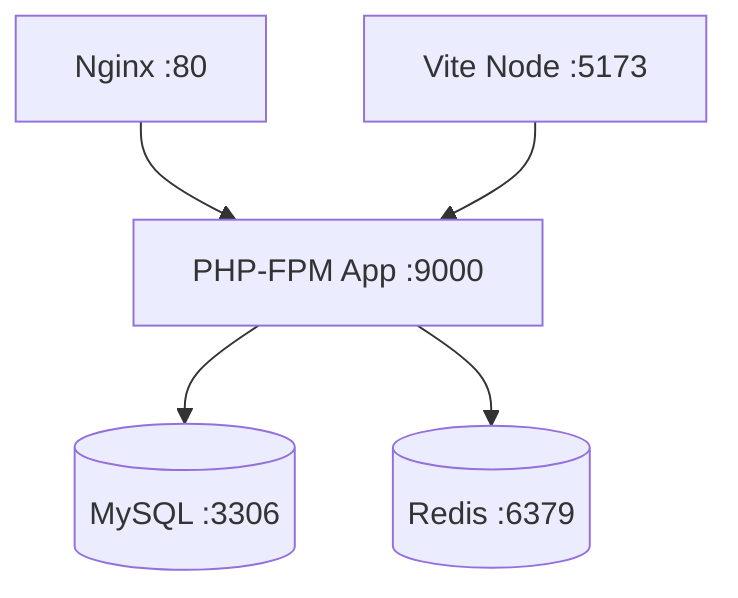

# Rapport de Projet de Fin d'Études
# **DentalLabPro — Plateforme de Gestion de Laboratoire Dentaire**

> **Filière :** Informatique / Génie Logiciel
> **Année universitaire :** 2025 – 2026
> **Réalisé par :** Ilyas
> **Encadré par :** *(à compléter)*

---

## Table des matières

1. [Chapitre 1 — Présentation du Projet](#chapitre-1--présentation-du-projet)
2. [Chapitre 2 — Modélisation et Conception du Projet](#chapitre-2--modélisation-et-conception-du-projet)
3. [Chapitre 3 — Environnement de Travail et Outils](#chapitre-3--environnement-de-travail-et-outils)
4. [Chapitre 4 — Réalisation du Projet](#chapitre-4--réalisation-du-projet)

---

# Chapitre 1 — Présentation du Projet

## 1.1 Introduction Générale

Le secteur dentaire repose sur une collaboration étroite entre les **cliniques dentaires** (chirurgiens-dentistes) et les **laboratoires de prothèses** (prothésistes dentaires). Historiquement, cette collaboration s'effectue via des bons de commande papier, des appels téléphoniques et des échanges physiques, ce qui engendre des retards, des erreurs de prescription et un manque de traçabilité.

**DentalLabPro** est une plateforme web full-stack conçue pour **numériser et centraliser l'intégralité du workflow** entre les cliniques dentaires et les laboratoires de prothèses. L'application couvre la gestion des commandes, le suivi de production, la facturation, la messagerie intégrée, la gestion des patients et les tableaux de bord analytiques.

## 1.2 Problématique

Le domaine de la prothèse dentaire souffre de plusieurs problèmes majeurs :

| Problème | Description |
|----------|-------------|
| **Manque de traçabilité** | Les commandes papier se perdent ou sont mal archivées. Aucun historique de statut. |
| **Retards de production** | Absence de système de suivi en temps réel pour signaler les retards ou les priorités. |
| **Erreurs de prescription** | Les formulaires manuscrits sont source d'ambiguïtés sur les teintes, matériaux et numéros de dents. |
| **Facturation opaque** | Difficultés à suivre les paiements, les soldes dus et la rentabilité par client. |
| **Communication fragmentée** | Les échanges clinique-laboratoire se font par téléphone ou SMS, sans trace centralisée. |
| **Gestion des patients dispersée** | Les dossiers patients sont déconnectés du flux de commandes prothétiques. |

## 1.3 Objectifs du Projet

DentalLabPro vise à résoudre ces problèmes en proposant :

1. **Un système de gestion des commandes** avec suivi en temps réel (machine à états : `new → in_progress → fitting → finished → shipped → delivered → archived`).
2. **Un odontogramme interactif** pour sélectionner visuellement les dents concernées lors de la création d'une commande.
3. **Une messagerie intégrée** (chat en temps réel via WebSocket) attachée à chaque commande.
4. **Un module de facturation complet** : factures labo-clinique, factures patient, suivi des paiements partiels.
5. **Des tableaux de bord analytiques** avec graphiques interactifs (chiffre d'affaires, volume de commandes, performance).
6. **Un système d'invitations** pour connecter cliniques et laboratoires partenaires.
7. **Un panneau d'administration** pour la supervision globale de la plateforme (utilisateurs, cliniques, labos, tickets de support, annonces système).
8. **Support multilingue** (Français / Anglais) avec basculement dynamique côté frontend.
9. **Un mode sombre / clair** avec transition fluide.
10. **Une landing page immersive** avec scène 3D Spline interactive.

## 1.4 Périmètre Fonctionnel

L'application est segmentée en **trois espaces distincts** avec des rôles d'accès contrôlés :

### 1.4.1 Espace Clinique (Dentiste / Personnel de clinique)

| Module | Fonctionnalités principales |
|--------|-----------------------------|
| **Dashboard** | Vue d'ensemble (commandes actives, rendez-vous du jour, patients récents, KPIs) |
| **Gestion des Patients** | CRUD complet, notes cliniques, historique médical, allergies, groupe sanguin |
| **Commandes Labo** | Création (odontogramme, teinte, matériau, instructions), suivi des statuts, upload de fichiers, duplication, annulation |
| **Rendez-vous** | Planification, agenda, gestion des consultations |
| **Facturation Patient** | Création de factures patient, enregistrement de paiements, gestion des plans de traitement |
| **Inventaire** | Suivi des stocks de matériaux et fournitures |
| **Analytiques** | Graphiques de performance, tendances, statistiques |
| **Exploration** | Découverte de laboratoires partenaires et leurs catalogues de services |
| **Équipe** | Gestion des membres de l'équipe clinique |
| **Paramètres** | Configuration du profil clinique, logo, informations de contact |
| **Plans de Traitement** | Création de plans par étapes avec suivi de progression |
| **Modèles de Commande** | Templates réutilisables pour les prescriptions courantes |

### 1.4.2 Espace Laboratoire (Propriétaire / Technicien)

| Module | Fonctionnalités principales |
|--------|-----------------------------|
| **Dashboard** | Vue globale de production (commandes en attente, en cours, expédiées, revenus) |
| **Commandes** | Réception, changement de statut (machine à états), notes internes, upload de fichiers |
| **Kanban** | Vue tableau de bord de production par colonnes de statut |
| **Services / Catalogue** | Gestion des services proposés (nom, prix, délais, catégorie, image) |
| **Clients** | Gestion des cliniques partenaires, système d'invitation par lien/email |
| **Finances** | Suivi des revenus par clinique, paiements reçus, soldes dus |
| **Factures** | Création et gestion des factures envoyées aux cliniques |
| **Calendrier** | Vue calendrier des commandes et échéances |
| **Analytiques** | Graphiques avancés (revenus, volumes, répartition par statut, par clinique) |
| **Rapports** | Génération de rapports détaillés de production |
| **Export CSV** | Export des données commandes et finances en format CSV |
| **Équipe** | Gestion des techniciens du laboratoire |
| **Paramètres** | Configuration du profil laboratoire, conditions générales |
| **Messagerie** | Inbox centralisée des conversations |

### 1.4.3 Espace Administrateur (Super Admin)

| Module | Fonctionnalités principales |
|--------|-----------------------------|
| **Dashboard** | Vue globale de la plateforme (nombre total d'utilisateurs, cliniques, labos, commandes) |
| **Gestion des Cliniques** | CRUD, activation/désactivation |
| **Gestion des Laboratoires** | CRUD, activation/désactivation |
| **Gestion des Utilisateurs** | CRUD, attribution de rôles, activation/désactivation |
| **Tickets de Support** | Réception et réponse aux demandes d'assistance |
| **Journaux Système** | Consultation des logs d'activité de la plateforme (audit trail) |
| **Annonces Globales** | Publication d'annonces système visibles par tous les utilisateurs |

## 1.5 Rôles et Acteurs



| Rôle | Code système | Permissions principales |
|------|-------------|------------------------|
| **Super Admin** | `super_admin` | Accès complet à l'administration de la plateforme |
| **Dentiste** | `dentist` | Gestion complète de la clinique (patients, commandes, équipe, paramètres) |
| **Personnel clinique** | `clinic_staff` | Gestion des patients et commandes (sans accès aux paramètres/équipe) |
| **Propriétaire Labo** | `lab_owner` | Gestion complète du laboratoire (services, finances, équipe, paramètres) |
| **Technicien Labo** | `lab_tech` | Traitement des commandes et notes internes (accès restreint) |

---

# Chapitre 2 — Modélisation et Conception du Projet

## 2.1 Architecture Globale

DentalLabPro adopte une **architecture MVC étendue** (Model-View-Controller) avec séparation complète du frontend et du backend :



**Flux de données :**
1. L'utilisateur interagit avec l'interface React.
2. Inertia.js intercepte la requête et l'envoie au backend Laravel.
3. Laravel traite la requête via le contrôleur approprié.
4. Eloquent ORM interagit avec MySQL pour les opérations CRUD.
5. La réponse est renvoyée comme une page Inertia (pas de recharge complète).
6. Les notifications temps réel transitent par Laravel Reverb (WebSocket).

## 2.2 Diagramme de Classes (Modèle de Données)

Le système repose sur **28 modèles Eloquent** interconnectés :



## 2.3 Modèles de Données Détaillés

### 2.3.1 Entités Principales (28 modèles)

| Modèle | Table | Description | Relations clés |
|--------|-------|-------------|----------------|
| `User` | `users` | Utilisateurs de la plateforme | belongsTo Clinic/Lab |
| `Clinic` | `clinics` | Cliniques dentaires | hasMany Users, Patients, Orders |
| `Lab` | `labs` | Laboratoires de prothèse | hasMany Users, Services, Orders |
| `Patient` | `patients` | Dossiers patients | belongsTo Clinic, hasMany Orders |
| `Order` | `orders` | Commandes de prothèses | belongsTo Clinic/Lab/Patient/Service |
| `Service` | `services` | Catalogue de services du labo | belongsTo Lab |
| `Invoice` | `invoices` | Factures labo-clinique | belongsTo Clinic/Lab |
| `Payment` | `payments` | Enregistrement de paiements | belongsTo Order |
| `Appointment` | `appointments` | Rendez-vous patients | belongsTo Clinic/Patient |
| `Message` | `messages` | Messages de chat | belongsTo Order |
| `OrderFile` | `order_files` | Fichiers joints aux commandes | belongsTo Order |
| `OrderStatusHistory` | `order_status_histories` | Historique des changements de statut | belongsTo Order |
| `OrderNote` | `order_notes` | Notes internes du labo | belongsTo Order |
| `OrderTemplate` | `order_templates` | Modèles de commande réutilisables | belongsTo Clinic/Lab |
| `Invitation` | `invitations` | Invitations clinique-labo | — |
| `Notification` | `notifications` | Notifications système | belongsTo User |
| `TreatmentPlan` | `treatment_plans` | Plans de traitement patient | belongsTo Patient/Clinic |
| `TreatmentPlanStep` | `treatment_plan_steps` | Étapes d'un plan de traitement | belongsTo TreatmentPlan |
| `PatientInvoice` | `patient_invoices` | Factures destinées aux patients | belongsTo Patient/Clinic |
| `PatientInvoiceItem` | `patient_invoice_items` | Lignes de facture patient | belongsTo PatientInvoice |
| `PatientPayment` | `patient_payments` | Paiements patients | belongsTo PatientInvoice |
| `PatientClinicalNote` | `patient_clinical_notes` | Notes cliniques | belongsTo Patient |
| `InventoryItem` | `inventory_items` | Inventaire de matériaux | belongsTo Clinic |
| `Transaction` | `transactions` | Transactions financières | belongsTo Clinic/Lab |
| `Ticket` | `tickets` | Tickets de support | — |
| `TicketMessage` | `ticket_messages` | Messages dans les tickets | belongsTo Ticket |
| `SystemLog` | `system_logs` | Journaux système | — |
| `Announcement` | `announcements` | Annonces globales admin | — |

### 2.3.2 Machine à États — Cycle de Vie d'une Commande



Les transitions sont **strictement contrôlées** par l'enum `OrderStatus` qui définit les transitions autorisées via la méthode `allowedTransitions()`. Toute tentative de transition invalide lève une `InvalidArgumentException`.

### 2.3.3 Statuts de Paiement

| Statut | Code | Description |
|--------|------|-------------|
| Non payé | `unpaid` | Aucun paiement enregistré |
| Partiel | `partial` | Paiement partiel reçu |
| Payé | `paid` | Montant total réglé |

## 2.4 Diagramme de Cas d'Utilisation



## 2.5 Architecture des Routes

Le routage est organisé en **3 groupes principaux** avec des middlewares de contrôle d'accès :

| Préfixe | Middleware | Rôles autorisés | Nombre de routes |
|---------|-----------|-----------------|------------------|
| `/clinic/*` | `role:dentist\|clinic_staff` | Dentiste, Personnel clinique | ~30 routes |
| `/lab/*` | `role:lab_owner\|lab_tech` | Propriétaire labo, Technicien | ~35 routes |
| `/admin/*` | `role:super_admin` | Super Admin | ~20 routes |
| `/` (global) | `auth` | Tous les rôles authentifiés | ~15 routes |

---

# Chapitre 3 — Environnement de Travail et Outils

## 3.1 Stack Technologique

### 3.1.1 Backend

| Technologie | Version | Rôle |
|-------------|---------|------|
| **PHP** | 8.2+ | Langage serveur |
| **Laravel** | 12.x | Framework backend (MVC, ORM, Auth, Queues) |
| **Eloquent ORM** | — | Mapping objet-relationnel et gestion des relations |
| **Laravel Breeze** | — | Scaffolding d'authentification (Login, Email verification) |
| **Laravel Sanctum** | 4.x | Authentification par sessions/tokens |
| **Laravel Reverb** | 1.x | Serveur WebSocket natif pour le temps réel |
| **Inertia.js** | 2.x (côté serveur) | Bridge backend-frontend sans API REST |
| **Ziggy** | 2.x | Exposition des routes Laravel au JavaScript |
| **Barryvdh/DomPDF** | 3.x | Génération de factures et fiches de travail en PDF |

### 3.1.2 Frontend

| Technologie | Version | Rôle |
|-------------|---------|------|
| **React** | 18.x | Bibliothèque UI composant-based |
| **TypeScript** | 5.x | Typage statique pour la fiabilité du code |
| **Inertia.js** | 2.x (côté client) | Navigation SPA sans rechargement de page |
| **TailwindCSS** | 3.x | Framework CSS utility-first pour le design |
| **Lucide React** | 0.574 | Bibliothèque d'icônes SVG |
| **Recharts** | 3.x | Bibliothèque de graphiques interactifs (charts) |
| **Three.js** | 0.183 | Moteur de rendu 3D (utilisé pour la landing page) |
| **@splinetool/react-spline** | 4.x | Intégration de scènes 3D Spline dans React |
| **React Hot Toast** | 2.x | Notifications toast premium |
| **date-fns** | 4.x | Utilitaire de manipulation de dates |
| **i18next** | 25.x | Framework d'internationalisation (FR/EN) |

### 3.1.3 Base de Données

| Technologie | Version | Rôle |
|-------------|---------|------|
| **MySQL** | 8.0 | Base de données relationnelle principale |
| **Redis** | Alpine | Cache, sessions, files d'attente |

### 3.1.4 DevOps & Outils

| Outil | Rôle |
|-------|------|
| **Docker** + **Docker Compose** | Conteneurisation (App PHP-FPM, Nginx, MySQL, Redis, Node) |
| **Vite** | 7.x — Bundler frontend ultra-rapide (HMR) |
| **Git** + **GitHub** | Versionnement et collaboration |
| **Composer** | Gestionnaire de dépendances PHP |
| **NPM** | Gestionnaire de packages Node.js |
| **PHPUnit** | Tests unitaires backend |

## 3.2 Architecture des Environnements

### 3.2.1 Environnement de Développement

```
composer dev
```

Cette commande unique lance simultanément :
- `php artisan serve` — Serveur Laravel (port 8000)
- `php artisan queue:listen` — Worker de file d'attente
- `php artisan reverb:start` — Serveur WebSocket
- `npm run dev` — Serveur Vite avec HMR (port 5173)

### 3.2.2 Conteneurisation Docker

L'application est entièrement dockerisée avec 5 services :



| Service | Image | Port | Rôle |
|---------|-------|------|------|
| `app` | `php:8.2-fpm` | 9000 | Application Laravel |
| `nginx` | `nginx:alpine` | 8000→80 | Reverse proxy |
| `db` | `mysql:8.0` | 3306 | Base de données |
| `redis` | `redis:alpine` | 6379 | Cache & Sessions |
| `node` | `node:18-alpine` | 5173 | Build frontend |

## 3.3 Structure du Projet

```
DentalLabPro/
├── app/
│   ├── Console/Commands/         # Commandes Artisan (ex: CheckOverdueOrders)
│   ├── Enums/                    # Enums PHP 8.1+ (OrderStatus, PaymentStatus)
│   ├── Events/                   # Événements (OrderStatusUpdated, MessageSent...)
│   ├── Http/
│   │   ├── Controllers/
│   │   │   ├── Admin/            # 7 contrôleurs admin
│   │   │   ├── Auth/             # 9 contrôleurs d'authentification
│   │   │   ├── Clinic/           # 14 contrôleurs clinique
│   │   │   └── Lab/              # 16 contrôleurs laboratoire
│   │   └── Middleware/           # RoleMiddleware (contrôle d'accès par rôle)
│   ├── Listeners/                # Écouteurs d'événements
│   ├── Models/                   # 28 modèles Eloquent
│   └── Notifications/           # Classes de notification
├── database/
│   ├── migrations/               # 41 fichiers de migration
│   ├── factories/                # Factories pour les tests
│   └── seeders/                  # Seeders de données initiales
├── resources/js/
│   ├── Components/               # 44 composants React réutilisables
│   ├── Layouts/                  # 5 layouts (Admin, Auth, Clinic, Guest, Lab)
│   ├── Pages/
│   │   ├── Admin/                # 14 pages administrateur
│   │   ├── Auth/                 # 6 pages d'authentification
│   │   ├── Clinic/               # 26 pages clinique
│   │   ├── Lab/                  # 24 pages laboratoire
│   │   └── Welcome.tsx           # Landing page immersive (~1100 lignes)
│   └── types/                    # Définitions TypeScript
├── routes/
│   ├── web.php                   # ~100 routes web organisées par rôle
│   ├── auth.php                  # Routes d'authentification
│   └── channels.php              # Canaux WebSocket broadcasting
├── docker-compose.yml            # Orchestration Docker
└── Dockerfile                    # Image PHP personnalisée
```

---

# Chapitre 4 — Réalisation du Projet

## 4.1 Landing Page Immersive (Welcome.tsx)

La page d'accueil de DentalLabPro est une landing page **premium et immersive** comprenant :

- **Scène 3D interactive** : Intégration d'une scène Spline avec un crâne 3D animé en arrière-plan, utilisant le mode `screen` blend pour un rendu cinématique.
- **Parallax scrolling** : L'effet de parallaxe sur le hero section suit le scroll de l'utilisateur.
- **Animation orbite de fonctionnalités** : Les 6 fonctionnalités principales tournent autour d'un noyau central avec des cartes 3D qui s'agrandissent au survol.
- **Section Écosystème** : Schéma architectural interactif montrant le flux du labo (colonnes gauche/droite + anneau central glowing) et le parcours patient numérique.
- **Mode dual (sombre/clair)** : Basculement via `filter: invert(1) hue-rotate(180deg)` avec protection des images.
- **Internationalisation** : Dictionnaire `TRANSLATIONS` intégré avec basculement FR/EN dynamique.
- **Section Contact** : Formulaire de contact avec informations de l'entreprise.

## 4.2 Système d'Authentification

Le système d'authentification repose sur **Laravel Breeze** personnalisé :

- **Login** : Interface premium avec champs stylisés, toggle mot de passe visible, option « Se souvenir de moi ».
- **Vérification email** : Validation obligatoire avant accès au dashboard.
- **Réinitialisation de mot de passe** : Flux complet (forgot → email → reset token → nouveau mot de passe).
- **Redirection contextuelle** : Après login, l'utilisateur est redirigé automatiquement selon son rôle (`lab → lab.dashboard`, `clinic → clinic.dashboard`, `admin → admin.dashboard`).
- **Inscription désactivée** : La création de comptes est gérée exclusivement par l'administrateur ou via le système d'invitations.

## 4.3 Module Clinique — Gestion des Commandes

### 4.3.1 Création de Commande

La création d'une commande prothétique intègre :

1. **Sélection du patient** : Liste déroulante des patients de la clinique.
2. **Sélection du laboratoire** : Parmi les labos partenaires connectés.
3. **Sélection du service** : Catalogue dynamique du labo sélectionné avec prix.
4. **Odontogramme interactif** : Composant React `<Odontogram>` permettant la sélection visuelle des dents (numérotation FDI internationale).
5. **Paramètres de la prothèse** : Teinte (shade), matériau, priorité, date d'échéance.
6. **Instructions détaillées** : Zone de texte pour les notes spécifiques.
7. **Upload de fichiers** : Empreintes numériques, photos, radiographies.

### 4.3.2 Suivi en Temps Réel

- **Timeline de statut** : Composant `<OrderTimeline>` affichant chaque transition avec horodatage et utilisateur responsable.
- **Badges de statut** : Composant `<StatusBadge>` avec code couleur dynamique.
- **Notifications** : Notifications en temps réel via WebSocket lorsque le labo change le statut.
- **Chat intégré** : Composant `<ChatBox>` attaché à chaque commande pour la communication directe clinique-labo.

## 4.4 Module Laboratoire — Production

### 4.4.1 Gestion des Commandes Entrantes

- **Tableau filtrable** : Composant `<OrderTable>` avec filtres par statut, clinique, priorité, date.
- **Actions en masse** : Mise à jour groupée des statuts (bulk operations).
- **Notes internes** : Annotations privées visibles uniquement par l'équipe du labo.
- **Fiches de travail** : Génération automatique de fiches de travail en PDF (Job Ticket) via DomPDF.

### 4.4.2 Vue Kanban

Le mode Kanban (`Lab/Kanban.tsx`) offre une vue **drag-and-drop** des commandes organisées par colonnes de statut :

`Nouveau → En cours → Essayage → Terminé → Expédié → Livré`

### 4.4.3 Finances et Facturation

- **Suivi par clinique** : Revenus, montants dus, paiements reçus par clinique partenaire.
- **Création de factures** : Sélection de commandes + application de TVA → génération de facture PDF.
- **Enregistrement de paiements** : Paiements partiels supportés avec calcul automatique du solde restant.
- **Export CSV** : Export des données de commandes et finances en CSV.

## 4.5 Module Administrateur

### 4.5.1 Dashboard Global

Le tableau de bord admin présente les KPIs de la plateforme :
- Nombre total d'utilisateurs, cliniques, laboratoires
- Volume global de commandes
- Graphiques de croissance et tendances

### 4.5.2 Gestion CRUD Complète

Chaque entité (Cliniques, Labs, Users) dispose d'interfaces CRUD complètes avec :
- **Listing paginé** avec recherche et filtres
- **Formulaires de création/édition** validés côté serveur
- **Toggle d'activation** : Activer/désactiver un compte sans le supprimer

### 4.5.3 Support et Communication

- **Tickets de support** : Système de ticketing avec conversation par messages.
- **Annonces globales** : Publication d'annonces visibles sur les dashboards de tous les utilisateurs.
- **Journaux système** : Audit trail des actions importantes (connexions, modifications, suppressions).

## 4.6 Composants Réutilisables (44 composants)

| Composant | Description |
|-----------|-------------|
| `Sidebar` | Navigation latérale contextuelle (Clinic/Lab/Admin) |
| `Odontogram` | Sélecteur visuel de dents interactif |
| `ChatBox` | Messagerie en temps réel par commande |
| `NotificationBell` | Cloche de notifications avec badge |
| `GlobalSearch` | Recherche globale toutes entités |
| `StatusBadge` | Badge de statut avec couleur dynamique |
| `OrderTimeline` | Timeline de l'historique d'une commande |
| `OrderPaymentSection` | Section de gestion des paiements |
| `Pagination` | Pagination réutilisable |
| `EmptyState` | État vide avec illustration |
| `ConfirmModal` | Modal de confirmation d'action |
| `FilePreviewModal` | Prévisualisation de fichiers joints |
| `FilterBar` | Barre de filtres génériques |
| `DateRangeFilter` | Filtre par plage de dates |
| `SplineBackground` | Intégration de scènes 3D Spline |
| `ThreeDViewer` | Visionneuse 3D Three.js |
| `ThemeToggle` | Basculement mode sombre/clair |
| `LanguageSwitcher` | Basculement de langue FR/EN |
| `Breadcrumbs` | Fil d'Ariane de navigation |
| `SkeletonLoader` | Indicateur de chargement squelette |
| `FlashToast` | Notifications toast temporaires |

## 4.7 Événements et Temps Réel

L'application utilise **Laravel Reverb** (serveur WebSocket natif) avec les événements suivants :

| Événement | Déclencheur | Canal |
|-----------|-------------|-------|
| `OrderStatusUpdated` | Changement de statut d'une commande | `order.{id}` |
| `OrderSubmitted` | Nouvelle commande créée | `lab.{id}` |
| `OrderUpdated` | Modification d'une commande | `order.{id}` |
| `MessageSent` | Nouveau message dans le chat | `order.{id}.chat` |
| `OrderMessageSent` | Message spécifique à une commande | `order.{id}` |
| `NotificationCreated` | Nouvelle notification | `user.{id}` |

## 4.8 Sécurité

| Mesure | Implémentation |
|--------|---------------|
| **Authentification** | Laravel Sanctum (sessions + CSRF token) |
| **Autorisation par rôle** | Middleware `RoleMiddleware` personnalisé avec support multi-rôle (`role:dentist\|clinic_staff`) |
| **Hachage des mots de passe** | Bcrypt automatique via le cast `hashed` d'Eloquent |
| **Validation des données** | Validation côté serveur dans chaque contrôleur |
| **Protection CSRF** | Token CSRF automatique via Inertia.js |
| **Soft Deletes** | Les commandes sont archivées, pas supprimées physiquement |
| **Rate Limiting** | Throttle sur la connexion, l'inscription et le chat |
| **Isolation des données** | Chaque clinique/labo ne voit que ses propres données (scoping par `clinic_id`/`lab_id`) |

## 4.9 Internationalisation (i18n)

L'application supporte le **français** et l'**anglais** :

- **Landing page** : Dictionnaire `TRANSLATIONS` inline avec basculement dynamique via `useState`.
- **Application interne** : Support via `i18next` + `react-i18next` avec détection automatique de la langue du navigateur.
- **Backend** : Support des fichiers de traduction Laravel (`lang/fr`, `lang/en`) pour les labels d'enums et les messages de validation.

## 4.10 Responsive Design et Accessibilité

- **Design responsive** : TailwindCSS breakpoints (`sm`, `md`, `lg`, `xl`) pour l'adaptation mobile/tablette/desktop.
- **5 layouts distincts** : `GuestLayout`, `AuthenticatedLayout`, `ClinicLayout`, `LabLayout`, `AdminLayout` — chacun avec sa barre latérale et sa navigation contextuelle.
- **Mode sombre / clair** : Basculement via attribut `data-theme` sur `<html>` avec inversion intelligente CSS + protection des images via `filter: invert(1) hue-rotate(180deg)`.

## 4.11 Statistiques du Projet

| Métrique | Valeur |
|----------|--------|
| **Modèles Eloquent** | 28 |
| **Contrôleurs** | 46 |
| **Pages React (TSX)** | 74 |
| **Composants réutilisables** | 44 |
| **Layouts** | 5 |
| **Fichiers de migration** | 41 |
| **Routes web** | ~100 |
| **Événements temps réel** | 6 |
| **Rôles utilisateur** | 5 |

---

## Conclusion Générale

DentalLabPro est une solution SaaS complète qui répond à un besoin réel du marché dentaire. En combinant les technologies modernes (Laravel 12, React 18, TypeScript, WebSocket, Docker), le projet offre une plateforme robuste, sécurisée et évolutive capable de :

1. **Numériser** l'ensemble du workflow clinique-laboratoire.
2. **Centraliser** la communication, la facturation et la traçabilité.
3. **Optimiser** la productivité grâce aux tableaux de bord analytiques et rapports.
4. **Engager** les utilisateurs grâce à une interface premium moderne avec des technologies 3D immersives.

### Perspectives d'Évolution

- Intégration de la **lecture de fichiers STL** (scans 3D intra-oraux) directement dans la plateforme.
- Module de **planification CAO/FAO** intégré pour la conception assistée par ordinateur.
- **Application mobile native** (React Native) pour les notifications et le suivi en mobilité.
- **Intelligence artificielle** pour la détection automatique des anomalies dans les empreintes numériques.
- **API ouverte** pour l'intégration avec les logiciels de gestion de cabinet existants.

---

> **Note :** Les erreurs de linting `readonly` affichées dans les rapports proviennent exclusivement du dossier `vendor/phpunit` et n'impactent en rien le fonctionnement de l'application. Elles sont liées à la version de l'analyseur syntaxique PHP de l'éditeur.
